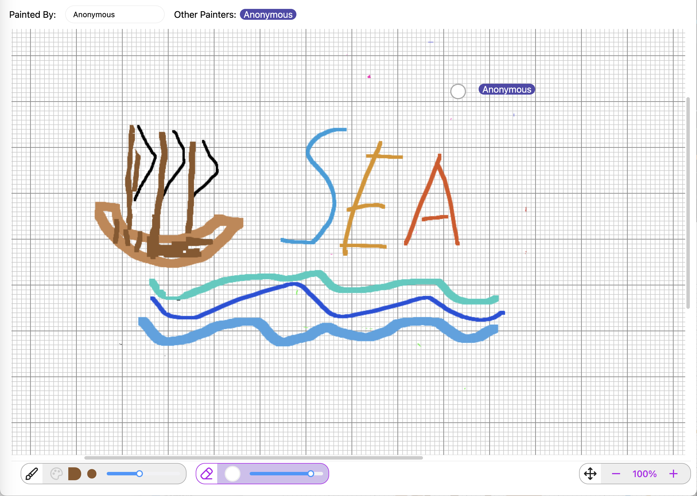

# multiplayer-drawing-app

**multiplayer-drawing-app** is a full-stack web application designed to 
let users freedraw collaboratively in real time.

## Features

### Pencil and Eraser
- Freedraw with pencil and eraser
- Control the thickness and color with pencil and thickness of eraser

### Multiplayer
- Draw together with other people, merging multiplayer drawing smoothly in real time
- Display the selected tool, cursor position and action of other players in real time

### Intuitive control
- Ctrl + Wheel to zoom
- Drag with left-mouse button to navigate
- Press Esc to quit using pencil or eraser

### Data persistence
- Backend local cache for saving artwork across sessions
- Reload artwork from database after restarting the backend server

## Tech Stack

- **Frontend**: NextJS, React, Redux, SCSS
- **Backend**: Java, Spring Boot
- **Database**: MongoDB

### Frontend

[Frontend Setup Instruction](drawing-frontend/README.md)

### Backend

[Backebd Setup Instruction](drawing-backend/README.md)

